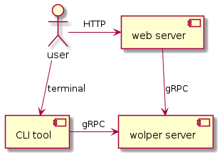

# wolper

## What is this

This is a helper program for solving [wordle](https://www.powerlanguage.co.uk/wordle/).

## System overview



## How to build

Just execute the `make` command.

## How to use

### CLI

1. Get English text data to construct the wolper's dictionary.
2. Assuming the input texts are located in `input` directory, you can build the dictionary file named `dict.txt` by the following command.
   ```
   ./wolper build [-i input] [-o dict.txt]
   ```
3. Run the wolper server as follows.
   ```
   ./wolper server [-i dict.txt] [-p TCP port#]
   ```
4. Run the wolper client as follows.
   ```
   ./wolper query [-k key] [-i included characters] [-e excluded characters] [--pos_exclude colon-separated characters] [-a IP address] [-p TCP port#] [-u] [--entsort]
   ```
   The sample output is shown below.
   ```
   $ ./wolper query -k fi.er -e powghtl
   address: localhost
   port: 8080
   include: 
   exclude: powghtl
   key: fi.er
   Connection succeeded.
   fiber
   finer
   fixer
   $ ./wolper query -k .z..e --entsort --pos_exclude bmj:::f:
   address: localhost
   port: 8081
   key: .z..e
   include: 
   exclude: 
   posExclude: bmj:::f:
   uniq: false
   entsort: true
   Connection succeeded.
   ozone
   ozzie
   azure
   ```

#### Unique search

If the unique search is enabled by "--uniq" flag, the result only includes words which consists of unique characters, that is, words not including the duplicated characters.

For example, a word "crane" is good, but "hello" is not allowed since it contains two "l"s in a single word.

#### Entropy based sorting

If the entropy based sorting is enabled by "--entsort" flag, the result is sorted according to the entropy score. If you choose the first word from the result, which has the highest entropy score, you can expect to get the correct word in the fastest way.

For the theoretical background, please check [this blog post](https://towardsdatascience.com/information-theory-applied-to-wordle-b63b34a6538e).

#### Exclusion for each position

Sometimes you might want to search words which include some characters, but you would not like the characters to sit in a specific position. In that case, you can use "--pos_exclude" option. You should specify the colon-separated characters as a value of the option. Each characters are then split with the colon and work as a exclusion list for each position.

For example, if you specify "ab:c::d:", the result does not contains the words which starts with "a" or "b", or contains "c" as a second character, or contains "d" for a fourth position.

### Web interface

The way to start the wolper server is the same with that of CLI.
Web interface can be used by the following steps.

1. Run the wolper web server as follows.
   ```
   ./wolper web [-a IP address] [-p TCP port#] [--wolper_port TCP port# of wolper server]
   ```
   Note that the IP address here is wolper server's one, not web server's. Also note that the TCP port# is for the web server whcich your are about to start.
2. Access to `http://localhost:"TCP port#"` on your web browser.
