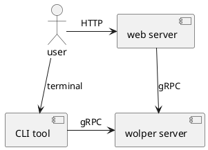

```plantuml
@startuml
actor "user" as user
component "web server" as web_server
component "CLI tool" as cli
component "wolper server" as app_server

user -> web_server : HTTP
web_server--> app_server : gRPC
user --> cli : terminal
cli -> app_server : gRPC
@enduml
```